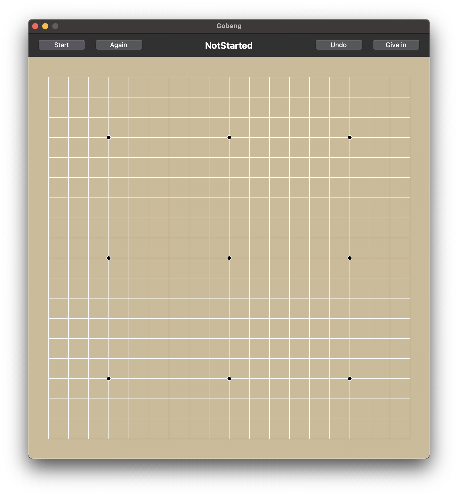

# Gobang
[](https://app.codacy.com/gh/IdealistYu/Gobang/dashboard?utm_source=gh&utm_medium=referral&utm_content=&utm_campaign=Badge_grade)


This is a simple Python implementation of the classic Gobang (Five in a Row) game. This project was created as a small assignment during my university days. 

## Screenshot



## Getting Started

```bash
git clone https://github.com/IdealistYu/Gobang.git
cd Gobang
python Gobang.py
```

## License

This project is licensed under the [MIT License](LICENSE).
